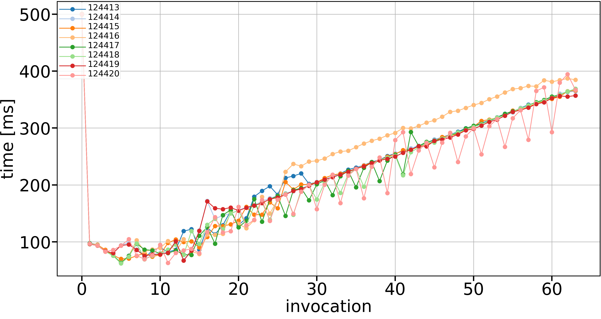

# Profiling experiment

This experiment traces the `tile.batch_inject_to_cells(0, pgen0)` calls in `pic.py` using `viztracer`.

`viztracer` needs to be installed for the experiment to work.

## Running the experiment

Use `sbatch submit.sh` to run the experiment on LUMI.

```bash
srun --cpu-bind=${CPU_BIND} ./select_gpu python -m viztracer --pid_suffix --log_sparse pic.py
viztracer --combine result*.json --output_file ${VIZTRACER_OUTPUT_DIR}/combined.json
rm result*.json
```

Here we run the experiment using sparse logging of `viztracer` to only log the function calls we've explicitly
marked in the files. Then we combine the files generated by each process to a single file called `combined.json`.

## Plotting the data

Use `plot_from_trace_data.py` on e.g. your own laptop to plot data from the trace file.

If you've copied the trace file to `/path/to/combined.json`
on your laptop, then plot the data with `python plot_from_trace_data.py /path/to/combined.json`.
The script reads the file and plots data similar to .
