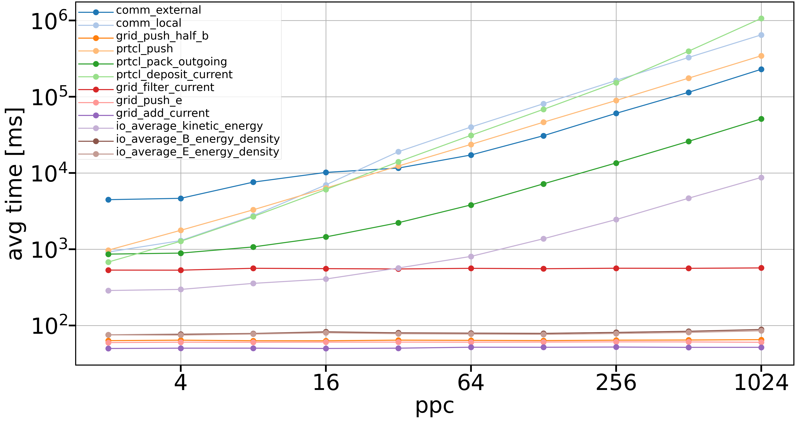

# Profiling experiment

This experiment traces the python functions that are called through the `self._action(name, *vargs, **kwargs)`
in `method_wrapper.py`. By applying the patch in this directory, one can change the `method_wrapper` to include
the needed changes.

The patch was made againts commit `e6420fc37c3102baa34bd78b14671828ad24b6e8`.

To apply it, do `git apply path/to/this/method_wrapper_viztracer.patch` in the root of the runko directory.

`viztracer` needs to be installed for the experiment to work.

## Running the experiment

Use `sbatch submit.sh` to run the experiment on LUMI.

It has a loop for running the experiments:
```bash
for ppc in 2 4 8 16 32 64 128 256 512 1024 2048
do
   sed -i "s/\(^[ ]\{4\}ppc =\) [0-9]*/\1 ${ppc}/" pic.py
   srun --cpu-bind=${CPU_BIND} ./select_gpu python -m viztracer --pid_suffix --log_sparse pic.py
   viztracer --combine result*.json --output_file ${VIZTRACER_OUTPUT_DIR}/ppc_$ppc.json
   rm result*.json
done
```

Here we use `sed` to change the `ppc` value in the `pic.py` script, then run the experiment using sparse logging
of `viztracer` to only log the function calls we've explicitly marked in the files. Then we combine the files
generated by each process to a single file called e.g. `ppc_2.json` for the case of `ppc = 2`.

## Plotting the data

Use `plot_from_trace_data.py` on e.g. your own laptop to plot data from the trace files.

If you've copied the trace files (e.g. `ppc_2.json`, `ppc_4.json` and `ppc_8.json`) to `/path/to/files`
on your laptop, then plot the data with `python plot_from_trace_data.py /path/to/files/ppc_ 2 4 8`.
The script reads the three files and plots data similar to .
